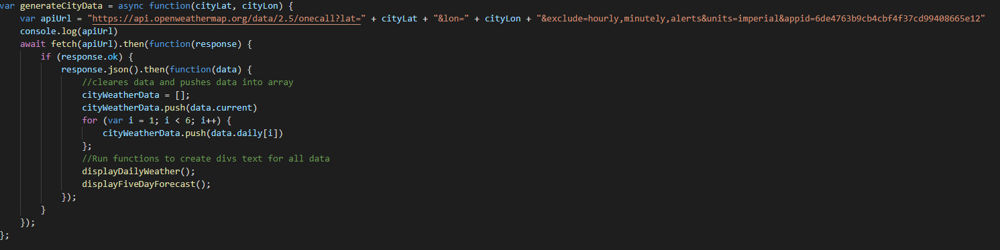

# Interactive Weather App

## Description
  This week I took a different approach to my coding method. After pseudocoding everything I decided to work solely on the html and javascript first and then get my styling underway. This proved more effective for me as going back and selecting all my classes to style was much easier. I struggled the most on getting my local storage to print on startup of the website. If I had not added a function to generate it when the window loads you would not be able to see it until you inputted a city. This was not good because I wanted the user to be able to just pick whichever city they had searched for already right when the website is loaded. First I started with my html. I decided to lay a framework for where I wanted everything to be as well as wireframed everything to see how I would be nesting my divs. From there I got to work on getting my city inputs to work. I ended up using the weather geo locater to grab the coordinates of the city so I could input it into the onecall api I was using. The cool thing about onecall api is that it has my weekly forecast and current weather as well as the UV index ready for me. This cut my needed apis from 3 or 4 to just 2. After I got all the data I wrote functions to grab all that data and get the usefull stuff from it. From there I made functions that would write the data down into the corresponding divs. I also used momentjs to grab the UNIX time that the api supplies and turn that into a date I could display. All the dom manipulation was streamlined by the use of jQuery as well. I wanted to save uv index color coding for last because I felt as if it was more of a styling job than that much javascript. For Icons I had <a> tags that linked to open weathers icon images. Alt attributes were sourced directly from the description of the icon given. After I finished all my javascript and tested it I moved on to css. This part was made super easy with boostrap. The only problem I had was that some classes in bootstrap take presidence over the other such as the list group items and the headings. I solved this by redefining them in my own stylesheet and assigning it as !important. 
## Installation
  Deployment url below! or if you would like to pull the code and see for yourself,
  ```bash
git clone https://github.com/aaronquach123/interactive-weather-app.git
```
## Usage
 1. Click deployment url
 2. Write any city into input.
 3. Click on submit button and current weather + five day forecast of the city will generate
 4. Click on any city on the history below the input area to see that city's weather
## Deployment
https://aaronquach123.github.io/interactive-weather-app/

## Screenshots




## Credits
1. [jQuery](https://jquery.com/) For DOM manipulation
2. [MomentJs](https://momentjs.com/) For converting UNIX time to desired form
3. [Bootstrap](https://getbootstrap.com/) For Icons and CSS Styling
4. [Open Weather Api](https://openweathermap.org/)


