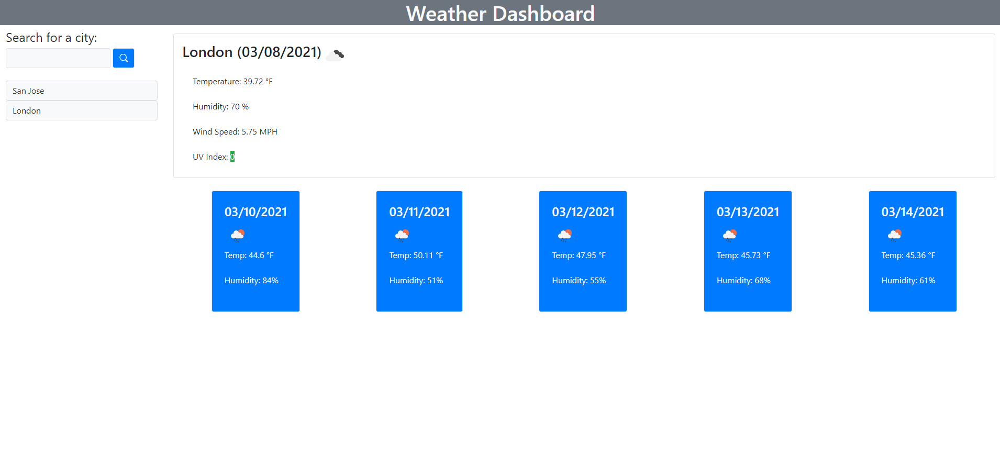
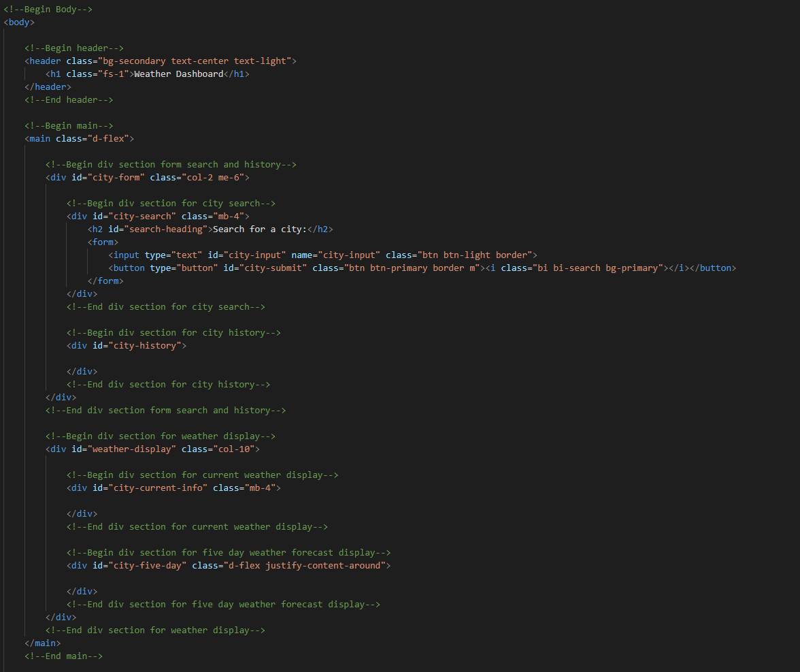
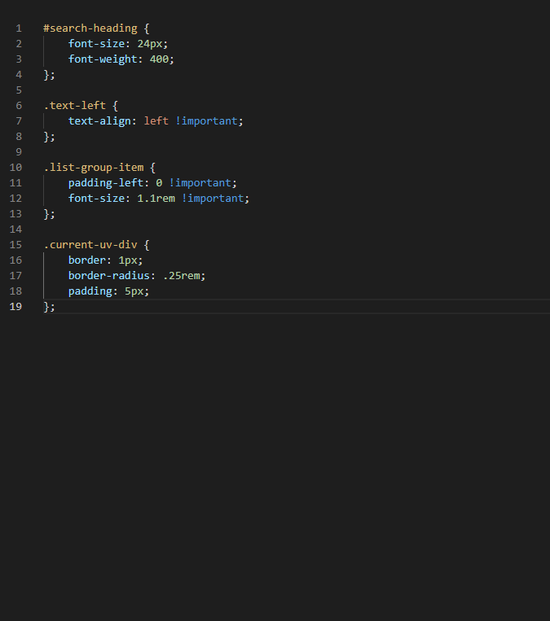

# Interactive Weather App

## Description
  This week I took a different approach to my coding method. After pseudocoding everything I decided to work solely on the html and javascript first and then get my styling underway. This proved more effective for me as going back and selecting all my classes to style was much easier. I struggled the most on getting my local storage to print on startup of the website. If I had not added a function to generate it when the window loads you would not be able to see it until you inputted a city. This was not good because I wanted the user to be able to just pick whichever city they had searched for already right when the website is loaded. First I started with my html. I decided to lay a framework for where I wanted everything to be as well as wireframed everything to see how I would be nesting my divs.
## Installation
  Deployment url below! or if you would like to pull the code and see for yourself,
  ```bash
git clone https://github.com/aaronquach123/interactive-weather-app.git
```
## Usage
 1. Click deployment url
 2. Write any city into input.
 3. Click on submit button and current weather + five day forecast of the city will generate
 4. Click on any city on the history below the input area to see that city's weather
## Deployment
https://aaronquach123.github.io/interactive-weather-app/

## Screenshots



 For DOM manipulation
[MomentJs](https://momentjs.com/) For converting UNIX time to desired form
[Bootstrap](https://getbootstrap.com/) For Icons and CSS Styling
